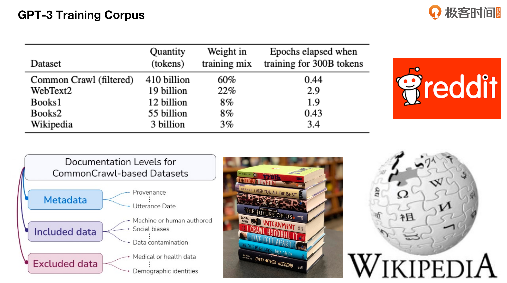

# 学习笔记

## 1. 预习篇-初探大模型-起源与发展
### 1.1. AI 的发展历史
1950 人工智能：早期人工智能引发兴奋
1980 机器学习：机器学习开始蓬勃发展
2010 深度学习：深度学习的突破推动人工智能蓬勃发展
2020 大语言模型：LLM已经踏上了通用人工智能的道路

https://mazieres.gitlab.io/neurons-spike-back/index.htm
https://medium.com/synthetic-intelligence/dialectic-of-ai-connectionism-vs-symbolism-d8b9888d4268
### 1.2. 注意力机制
#### 1.2.1. 什么是注意力机制
> 去了几次咖啡厅的例子

高频 != 重点，要找到关键信息，理解关键信息
#### 1.2.2. 为什么需要注意力机制
> 上课记笔记的例子

话说太长了，就忘记了前面说了什么：循环神经网络（RNNs）

好记性不如烂笔头：LSTM 是一个RNN的变体，是一个类似于ResNet的跨层连接，在每一个词去处理前文的时候，可以理解为会有一个A4纸，一直在记，但是当A4纸记满了的时候，就要去浓缩、抽象

虽然有了记事本，但如何去浓缩，如何去抽象，还是一个难题，这就是好学生和差学生之间的区别，谁的课堂笔记质量好，谁的课堂笔记跟他脑子里面的东西是匹配起来的，这个也就是注意力机制要解决的问题 -- 我能够给你一页A4纸，我还可以教会你怎么记笔记，甚至是记笔记都不需要A4纸，在学的过程中提升学习效率，这是一个讨论，在任何领域都可以应用（自然语言处理、计算机视觉、跨模态多模态任务的任务和推荐系统里面，都可以使用）

第一，解决了RNN的问题
第二，效果好，自然语言，图像识别，多模态任务等
第三，增加了深度学习，神经网络的可解释性
#### 1.2.3. 如何实现注意力机制
##### 1.2.3.1. Overcoming challenges with RNNs
1. 解决传统编码器-解码器模型的挑战，避免信息损失和无法建模`输入输出对齐`的问题。
- **注意力机制如何解决RNN中的对齐问题？**
```markdown
传统RNN的问题：
- 信息损失：想象一下你在读一本很长的小说，读到最后几章时，你可能已经忘记了开头的很多细节。传统RNN也有类似问题，当序列很长时，早期的信息会逐渐"淡化"。
- 对齐困难：就像两个人说不同语言时的对话需要逐句翻译。

举个例子
- 英文："The cat which I saw yesterday in the garden is black"
- 中文："我昨天在花园里看到的那只猫是黑色的"

人类翻译时：
- 必须等整句话听完
- 因为中文的语序是："我(I) + 昨天(yesterday) + 在花园里(in the garden) + 看到的(saw) + 那只猫(the cat) + 是黑色的(is black)"
- 如果不听完整句，根本无法正确重组语序

注意力机制的实际工作方式：
- 并不是简单的逐字逐句翻译
- 而是在生成每个目标词时，都可以"查看"整个源句子
- 比如生成"我"时，模型会关注整个句子，因为需要理解谁是动作的主体
- 生成"昨天"时，虽然"yesterday"在原句中间，但模型可以找到它并在正确的位置使用

所以更准确的理解是：
- 注意力机制`不是为了实现同步翻译`
- 而是为了解决`在已经看到整句话的情况下，如何更好地利用所有信息`
- 它允许模型在生成每个词时，动态地决定应该关注源句子的哪些部分

这就像：
- 传统RNN：必须把整句话压缩成一个固定的记忆，然后从这个记忆中还原
- 注意力机制：像是在翻译时手里握着原文，需要翻译哪个部分就可以看哪个部分，更灵活也更准确
```
2. 允许解码器访问整个编码的输入序列，通过注意力权重选择性关注信息。
3. 自动学习注意力权重，捕捉编码器和解码器之间的相关性。
4. 构建上下文向量，使解码器能够全面访问输入序列并重点关注相关部分。
5. 提高模型性能，改善输出质量，并提供更好的解释性。
##### 1.2.3.2. Encoder-decoder Architecture with Attention Model
人做翻译：人`理解`了这个词，有文化的积累，脑海中有画面，有抽象的能力
机器做翻译：就是`找对应关系`，是一个概率学上的问题，是数学问题
```markdown
**举一个具体的例子来说明人类翻译和机器翻译的区别：**
假设我们要翻译这句英文：`The leaves are dancing in the wind.`

人类翻译的过程：
- 理解词义：理解 `leaves`（树叶）、`dancing`（跳舞）、`wind`（风）
- 形成画面：脑海中会浮现出树叶在风中飘动的`画面`
- 文化积累：知道这是一个`拟人化的表达`，在中文里也有类似的优美表达
- 抽象理解：明白作者想要表达的是一种优美、轻盈的自然景象
- 最终翻译：可能会译为`树叶在风中翩翩起舞`，而不是生硬的字面翻译

机器翻译的过程：
- 统计分析：查找训练数据中 `leaves`、`dancing`、`wind` 这些词最常见的中文对应词
- 概率计算：计算不同翻译组合的`概率分布`
- 语法规则：应用预设的语法规则进行排列组合
- 最终翻译：可能会直接翻译为`叶子在风中跳舞`，这种更直白的表达

这个例子展示了：
- 人类翻译会运用文化理解、意象联想和抽象思维
- 机器翻译主要依赖统计概率和预设规则
- 人类能够产生更优美、更符合目标语言习惯的翻译
- 机器翻译虽然准确，但可能缺乏文化内涵和艺术美感
```


- Encoder-decoder
```markdown
输入：  x1("I") → x2("love") → x3("you")
编码：  h1     →    h2      →   h3
解码：  s1     →    s2
输出：  y1("我") →  y2("爱")

编码器(h1,h2,h3)先理解整个英文句子
解码器(s1,s2)再基于这个理解来生成中文翻译
h1, h2, h3 (编码器隐藏状态)：是编码器处理后的中间状态，每个h都包含了到当前位置的信息，比如 h1 包含了对 x1 的理解，h2 包含了对 x1 和 x2 的理解，h3 包含了对整个输入序列的理解
```
- Encoder-decoder Architecture with Attention Model
```markdown
context vector：上下文向量，α1, α2, α3 是注意力权重，表示每个编码器隐藏状态对解码器的重要性

不再是击鼓传花，而是每个词都去看一遍，然后根据重要性来决定是否要关注

注意力权重 α 捕捉了 h 和 s 的相关性
多个注意力权重，整体构成了一个矩阵，这个矩阵就是我们要学习的东西（Deep Learning、Machine Learning）
注意力权重，是我们要学习的一个参数，这个参数整体构成了一个矩阵，这个矩阵可以作用于我们的输入和输出（Sj-1 和 hi），这个整体的函数是 alignment function，对齐函数

打比方
- h 是输入的笔记
- s 是没来的人学习的笔记
- α 是关注的重点，没来的同学关注的重点
```
##### 1.2.3.3. Attention Mechanism
`Attention Mechanism` 第一次把机器翻译中的翻译问题和对齐问题，用一个网络搞定了
```markdown
用更通俗的话说：
- 传统方法像是，先在字典里找到每个词的对应，再组合成句子
- 注意力机制像是，看整句话，一边找对应关系，一边翻译，就像人类翻译的思维过程
它把原本分开的`两个任务（找对应词+翻译）`通过这个数学公式合并成了一个自然的过程
```

以前做NLP，就是干一个任务，做一个模型，然后把很多模型串起来，现在是用一个网络去学习很多任务；并且对语义的理解提供了一个新的思路，`Transformer` 就是这样去做的
##### 1.2.3.4. Generalized Attention Model


对齐函数的学习方式，可以有很多种
```markdown
就像找餐厅：
- 有人就看距离
- 有人会综合考虑多个因素
- 有人参考别人的经验
- 每种方式都有其适用场景

为什么需要多种方式：
1. 不同场景有不同需求：
- 有时需要快速简单的匹配
- 有时需要精确复杂的匹配
2. 数据特点不同：
- 有的数据适合用统计方法
- 有的数据适合用神经网络
3. 计算资源限制：
- 简单方法计算快，适合实时处理
- 复杂方法更准确，但需要更多计算资源
4. 可解释性需求：
- 简单方法容易解释原理
- 复杂方法可能更准确但难以解释
```

参数化的方法，根据你特定输入数据，去学习出一个特定的超参数，符合你特定输入数据的概率分布，它的适用范围更广
```markdown
想象你在开一家奶茶店：
1. 非参数化方法（像是老师傅凭经验，照搬菜谱）：
- 记住每个顾客的具体口味
- 新顾客来了就找最相似的历史订单
- 局限性：只能应对见过的情况
2. 参数化方法（像是研发配方，学会烹饪原理）：
- 奶茶口感 = a×糖度 + b×温度 + c×茶浓度 + d×奶浓度
- 学习参数a、b、c、d，这些参数反映了顾客群体的整体偏好，可以应对新的组合
```
#### 1.2.4. Transformer的崛起
##### 1.2.4.1. Key Components of Attention Modeling Techniques


从上到下解释这张图的关键组成部分：
```markdown
1. 注意力机制类型（Attention Mechanism Types）：
- 序列类型：区分性注意力、共同注意力、自注意力
- 层级：单层或多层
- 位置：软性、硬性、局部、全局
- 表示：多重表示、多维度
2. 神经网络架构（Neural Architectures）：
- 编码器-解码器
- Transformer
- 记忆网络
- 图注意力网络
3. 注意力建模技术（Attention Modeling Technique）：
- 这是核心部分，由上面两个部分共同决定使用什么样的注意力技术
4. 问题特征（Problem Characteristics）：
- 输入数据类型：序列、图像、图、表格数据
- 输出数据类型：序列、图像、嵌入、标量
- 注意力性质：自注意力、多层级
5. 应用领域（Applications）：
- 机器翻译
- 问答系统
- 文本摘要
- 图像分类
- 多媒体描述
- 图分类
- 用户画像
- 情感分析
- 语音识别
```

这个框架帮助我们系统地理解和选择合适的注意力机制：
```markdown
1. 如何选择注意力机制：
- 先看应用场景（最下面）
- 再看问题特征（中间）
- 然后选择合适的注意力类型和架构（上面）
2. 决策流程：
- 从底部（应用）开始
- 向上确定问题特征
- 最后选择具体的技术实现
3. 就像是：
- 你要盖房子
- 先确定用途（住宅？商铺？）
- 再确定特征（几层？多大？）
- 最后选择具体的建筑技术和材料
```
##### 1.2.4.2. seq-aligned RNNs -> self-attention


序列对齐的RNN -> 自注意力

左边是一个机器翻译的场景，使用了 `seq-aligned RNN` 的可视化结果，它解决的问题是，特定的一个语言里面的单词要和另外一个语言里面的单词对齐（法语中的zone和英语中的area，高亮体现了它们之间的关系），这两个词的意义一样，即学习了对齐，又学习了翻译
右边的 `self-attention` 它解决的不是翻译问题，它想要提升语义理解的能力，它想要理解一句话里面的单词之间的关联关系
##### 1.2.4.3. Self-attention  
###### 1.2.4.3.1. Scaled Dot-Product Attention


\[\text{Attention}(Q, K, V) = \text{softmax}(\frac{QK^T}{\sqrt{d_k}})V\]

其中:
- Q (Query): 查询矩阵，表示当前位置需要关注的信息
- K (Key): 键矩阵，用于和查询矩阵计算相关性分数
- V (Value): 值矩阵，存储实际的信息内容
- d_k: Key的维度，用于归一化
- softmax: 将分数转换为概率分布

`Scaled Dot-Product Attention`（缩放点积注意力）是 Transformer 模型中的一个核心机制，`它干了以下这么一件事`：
矩阵相乘，然后 Scale 一下，再做一个掩码，输出一个 SoftMax，再跟我们的输入做一个矩阵相乘
###### 1.2.4.3.2. Multi-Head Attention


QKV仍然是输入，这里的 h，就是把 `Scaled Dot-Product Attention` 做并列的多个，然后再把这些结果 Concat 连接在一起，再做一次线性变换
`有点类似于干了这么一件事`：
- 我对课程可以做笔记，可以录音，可以录视频，针对不同的学习方式，我可以用不同的方法来记录
- 通过笔记我做成一个 `Scaled Dot-Product Attention`，通过录音做一个 `Scaled Dot-Product Attention`，通过录像我再做一个 `Scaled Dot-Product Attention`
- 这三个学出来的内容都是针对QKV做学习，这三个QKV的学习成果，最终再把它拼起来，再给到后面去学习
###### 1.2.4.3.3. Feed Forward


注意力机制帮你找到重要信息，Feed Forward 则帮你加工这些信息
就像现在图书馆找到相关的书（注意力），然后认真阅读理解这些书（Feed Forward）
这样的设计让 Transformer 既能关注重要信息，又能深入理解这些信息
##### 1.2.4.4. Transformer: Encoder-Decoder


整体的网络结构，就长左边这样，是右边的结构的 High-Level 描述


Transformer 虽然提出了一个全新的网络结构
- 第一点：它没有用 RNN，所以自己造了一个 `Positional Encoding` 位置编码，位置编码有两种方式
- 第二点：仍然是一个 Encoder-Decoder 结构，只不过里面没有用 RNN 来生成 H 和 S，而是通过 `self-attention` 注意力机制 和 `feed-forward` 前馈申请网络 生成了一个我们中间过程当中学到的变量，类似于隐藏状态


左边的图：越往后，注意力越集中（越好），红色的是浅层次的，绿色的是深层次的；可以通过这个来观察 `self-attention` 学到了什么东西
右边的图：不同的颜色表达了不同的多头 Attention，每一个头的学习效果，虽然有不同层次，但是在一些特定的词上面，相当于投票，三个臭皮匠顶一个诸葛亮，不同的头都指向了同一个结果，说明这个结果是很可信的
##### 1.2.4.5. Why Transformer Important
第一点：它抛弃了RNN，RNN天然的一些弱点，就被它抛弃了
第二点：它是一个面向 GPU 并行非常友好的计算
- 而 RNN 是前后依赖的，学完一年级才能学二年级，对与 GPU 并行计算而言，我不关注依赖顺序，你最好一起学
- 而 Transformer 是并行的，在 decoder 部分没有依赖关系，可以并行的算，天然的训练效率更高，能训练更大的模型，后面的 GPT 就是把6层干到几十层，甚至上百层
第三点：Sentence-level representations，我们开始看到最低机制，两个词之间的关系我能找出来，但是我想能捕获一段话的这个含义的时候，捕获不了，但是 Transformer 可以，可以捕获到更长的语义信息，为我们的下游任务做更多的储备，你理解了语义，你自然做更多的任务

Transformer 它为我们现在这种基础模型在对接下游任务，体现出了它的一个前瞻性
比如，以前我要训练一个问答机器人，训练一个信息提取的模型，都要做很多不同的大量的训练，训练成本很高，Transformer 为主的这种基础模型，做到了一件事情，Transformer 的基础模型，尽可能多的给你数据，花大价钱，大时间，大成本，搞出一个牛逼的基础模型，就跟 GPT3.5 一样，能干很多事情，完了之后，下游任务再去做轻量地适配
#### 1.2.5. GPT与BERT的选择
##### 1.2.5.1. 神经网络的发展


神经网络有很多发展方向：
- LSTM系列的，RNN系列的，包括像CNN系列的，都是在网络结构层面上，做过一些不同的迭代，去解决一些特定的问题；RNN解决时序问题，CNN解决图像、计算机视觉方面的问题
- Embeding 是一个很重要的发展方向，比如，Word2vec、GloVe
- 14年的时候出现的新的分支，注意力机制，14-17年的Transformer，各种各样的对齐函数的出现，后续又引进了不同的大语言模型，GPT 和 BERT

BERT 使用了深度的 Transformer，是一个双向的 Transformer，用来做语义理解，它在11个非常有代表性的自然语言处理任务上获得了最好的成绩（GLUE、SWAG、CoNLL等）


BERT 提出了一种新的范式，就是 `Pre-train` 和 `Fine-tune`，`Pre-train` 就是预训练，`Fine-tune` 就是微调
- 有一个基础模型，针对下游任务去做适配，上游给大量的数据，做预训练
- 下游只需要做很少的任务，做微调，把 BERT 变成一个特定领域的模型

要提升语义理解能力，我们需要训练一个很有用的基础模型，训练一个基础模型在计算机视觉领域，用的是 ImageNet 带有标注的数据集，需要巨大的成本；但是在自然领域，做这样一个训练集很难，它不修图像领域，天然有一个好处，不同国家的人看到这只鸟，大家都知道它叫鸟，只是单词不一样；自然语言不同，一只鸟的图片，标注一次就够了，只需要换标记就好了，但是一段话，怎么样去给它打标记呢

BERT 最关键的一点，`Unlabeled Sentence A and B pair` 这句话，它用的是大量的无标注数据，把人类历史上所有的书籍、数据，拿过来直接做预训练，训练出一个语义理解能力很强的模型，这个模型只需要少量的标注数据就能解决下游的具体任务

BERT 独特的价值
1. 全方位上下文理解：与以前的模型（例如GPT）相比，BERT能够双向理解上下文，即同时考虑一个词的左边和右边的上下文。这种全方位的上下文理解使得BERT能够更好地理解语言，特别是在理解词义、消歧等复杂任务上有明显优势。
2. 预训练+微调（Pre-training + Fine-tuning）的策略：BERT模型先在大规模无标签文本数据上进行预训练，学习语言的一般性模式，然后在具体任务的标签数据上进行微调。这种策略让BERT能够在少量标签数据上取得很好的效果，大大提高了在各种NLP任务上的表现。
3. 跨任务泛化能力：BERT通过微调可以应用到多种NLP任务中，包括但不限于文本分类、命名实体识别、问答系统、情感分析等。它的出现极大地简化了复杂的NLP任务，使得只需一种模型就能处理多种任务。
4. 多语言支持：BERT提供了多语言版本（Multilingual BERT），可以支持多种语言，包括但不限于英语、中文、德语、法语等，使得NLP任务能够覆盖更广的语言和区域。
5. 性能优异：自BERT模型提出以来，它在多项NLP基准测试中取得了优异的成绩，甚至超过了人类的表现。它的出现标志着NLP领域进入了预训练模型的新时代。
6. 开源和可接入性：BERT模型和预训练权重由Google公开发布，让更多的研究者和开发者可以利用BERT模型进行相关研究和应用开发，推动了整个NLP领域的发展。
##### 1.2.5.2. Word Embedding


Word Embedding：NLP中的一个很基础概念，13年的时候，Word2Vec 发布出来，它要解决，把一个单词变成一个可以用来做运算的向量
- 自然语言本身是没法去做复杂的推理运算的（计算机理解不了自然语言，计算机只会去做一些逻辑运算，概率分布的运算），我们需要把这个问题变成一个数学问题，第一步就是把一个单词变成一个可以用来做云算的向量（向量有多少维度很重要，每个维度里的值是什么也很重要）
- Word2Vec 和 GloVe 都是用来学，怎么样把一个词变成一个什么样的向量，这样的一些算法和方法
- 当时 Word2Vec 发布出来的时候，有一个很好的例子，`King 和 Queen` 学出来后，把它们做一个差值，和我的另一门语言 `国王 和 皇后` 去做差值，Embedding 运算后的结果是相似的；这个让大家看到理解语义是有可能的，只不过 Word2Vec 是基于单词去学，有没有可能是一句话，一个短语，一段话上面去学，这个是 Word Embedding 和 预训练 Embedding（GPT 3.5）最大的一个区别
##### 1.2.5.3. Bidirectional Models


站在当时，BERT 要解决的问题是：
- 第一，这些从左到右看的语言模型，天然就缺失了双向的信息
- 第二，为什么我们的语言模型一定要是单向的，双向学习概率分布会不会更好，更健壮


BERT 如何在未标注的文本上进行预训练？
就跟我们小时候学英语，做完形填空一模一样，这段话中有一些关键的词，它需要理解语义
- 一段话中，有 15% 的词是有 [MASK]
- 在这 15% 中
  - 有 80% 直接替换成 [MASK]
  - 有 10% 随机替换成另外一个词
  - 还有 10% 不做替换，正确答案


BERT 做了大量的预训练学习，还想学习句子之间的关系，比如 A 和 B 是不是紧挨着，它会打上一个标签
这个告诉大家，当我们学会了上面的语义理解能力后，下游任务，就可以通过这样的方式做标注，这个也是大部分预训练语言模型的 Fine-Tuning 的一个常见套路
##### 1.2.5.4. BERT vs GPT
1. BERT vs GPT 差异
| 特性     | BERT                                                 | GPT                                    |
| -------- | ---------------------------------------------------- | -------------------------------------- |
| 训练方式 | 自编码（Autoencoding）                               | 自回归（Autoregressive）               |
| 预测目标 | 给定上下文，预测其中的一个或多个缺失单词             | 在给定前面的单词时，预测下一个单词     |
| 输入处理 | 双向，可以同时考虑一个词的左右上下文                 | 单向（从左到右或者从右到左）           |
| 适用场景 | 适合理解上下文，有助于信息提取、问答系统、情感分析等 | 适合生成式任务，如文章生成、诗歌创作等 |
| 架构     | 基于Transformer的编码器                              | 基于Transformer的解码器                |
| 语言模型 | 判别式（Discriminative）                             | 生成式（Generative）                   |
| 优点     | 对上下文理解能力较强                                 | 预测的连贯性较强                       |
| 缺点     | 生成的文本连贯性较弱                                 | 对上下文理解能力相对较弱               |

2. BERT vs GPT 共识
`模型架构` Transformer
`数据预处理` 都需要对数据进行Tokenization，一般使用词片方法 (Subword Tokenization)
`模型训练` 均使用了大量的无标签数据进行预训练
`任务迁移` 都可以通过Fine-tuning方式进行任务迁移
`训练目标` 都试图通过预训练理解语言的一般模式，如语法、语义、上下文关系等
`多语言支持` 均支持多语言模型训练

## 2. 预习篇-GPT模型家族-从始至今
### 2.1. NLP 语言模型技术发展一览


语言模型 -> 大语言模型
大语言模型的核心：
- 首先，都是属于预训练模型的这种技术上的范畴
- 不同点在于，它的模型`规模参数量`到了一个新的高度，新的高度带来了很多好处
  - 涌现能力的出现
  - 训练技巧变多了
    - 可以用指令微调（Instruction-Tuning），提示词微调（Prompt-tuning），强化学习（RLHF）
    - 在这个过程中，我变成了一个线上应用，我还在拿线上数据，线上数据又会反过来变成基于人类的反馈的强化学习的训练数据
大语言模型跟预训练模型本质区别：用户反馈变多了
### 2.2. GPT模型家族
#### 2.2.1. 概要
##### 2.2.1.1. 预训练语言三大架构分支


1. Encoders (编码器架构) ：这类模型主要用于理解输入文本的含义，生成文本的上下文表示。它们通常是双向的，能同时考虑一个词左右两边的上下文。
2. Decoders (解码器架构) ：这类模型主要用于生成文本，它们通常是单向的（自左向右），根据已经生成的上文来预测下一个词
3. Encoder-Decoders (编码器-解码器架构) ：这类模型结合了前两者的特点，既有理解输入序列的编码器部分，也有生成输出序列的解码器部分。
##### 2.2.1.2. 自然语言处理模型中上下文表征的演变历史
1. 静态表征阶段 ：早期模型如Word2Vec 使用固定词向量
银行 = ①金融机构 ②河岸 
模型无法区分"我去 银行 存款"和"河岸 银行"的差异
2. 动态表征阶段 ：ELMo 首次实现基于上下文的动态表征
根据句子调整词义：
"这个 苹果 很甜" → 水果 
"苹果 市值破万亿" → 科技公司
但无法理解跨句关系，如"它从树上掉落"指苹果
3. 深度上下文阶段 ：Transformer架构 通过自注意力机制实现全局上下文建模
理解整段话的隐含逻辑"银行vault需要加固。考虑到最近的盗窃案，我们决定采用钢制结构"
准确识别vault指"金库"而非"拱顶"，并关联"盗窃案"的安防需求
#### 2.2.2. GPT-1


1. GPT-1 做了什么事情 2018年夏天
把Transformer的6层干到了12层，接着把Transformer里面的自注意力机制进行了更大规模的训练，然后下游去做各种微调，得到了一些比较好的结果
- 用了12层的 Transformer decoder 架构，用了 117M（1.1亿） 的模型参数
- 768 维的隐层，3072 维的 feed-forward 隐藏层
- 字节编码长度，用了 40000 个 encoding
- 训练集是 7000 本不同的书，这里面包含了一些比较长距离依赖的语句
下游任务有三类：分类（Classification）、蕴含（Entailment）、相似（Similarity）

2. NLP基准测试，就像高考题，用来做区分度
当时很多人认为，GPT-1从学术价值来说，没有什么新意，也没有得到特别大的提升，大家关注不多；对比 SNLI
- Finetuned Transformer LM（ours）：89.9
- ESIM + ELMo【44】（5x）：89.3
#### 2.2.3. GPT-2
1. GPT-2 做了什么事情 2019年
在GPT-1的基础上，只干了这么一件事情：将1.1亿的模型参数，干到15亿，把训练集给加多一些（模型变大了，消化能力变强了，喂更多的数据）
虽然很多人看不上GPT，但是GPT-2有它的贡献
- 在AI工程上的设计，包括模型上面的一些技巧
- 它还提出了一个重要的思想：GPT-3就是沿着这样一个设想去实现的
  - 之前，都是用pre-train + fine-tuneing的方式，做预训练和微调，无论如何，下游的任务还是要做微调
  - GPT-2 在思考的问题是，有没有可能把数据喂的足够多，就不需要做微调了，把fine-tuneing的事，在一次学习里面就搞定
#### 2.2.3. GPT-3
1. 当时大语言研究的现状


2020年，GPT-3 发布没多久，整个大语言模型研究的学术界和工业界的一个主要图谱（清华NLP实验室，质谱实验室出的图）
- BERT 是毫无疑问的核心，BERT开枝散叶了很多
  - 包括多语言的，多任务的，生成的，包括加知识图谱的，多模态的
  - 然后Encoder-Decoder的，就生成了T5的这个方向，包括像MoE的（混合专家系统），出现了Switch Transformer
- GPT 是旁边的一个小分支，没有多少人关注（可以看到图中，对比其他分支的标签，GPT的就是 Larger） 
  - GPT-2是怎么来的：一个小模型，怎么变成 GPT-2的，更大的模型，更多的数据
  - GPT-3是怎么来的：Larger，更大一点 
2. GPT-3 做了什么事情 2020年



- 进一步增加了数据，增加了互联网的数据
  Common Crawl 爬虫项目，4100亿的 Tokens
  之前的维基百科，书的数量增多了
  还增加了各种互联网的文本，包括像 Reddit 这种问答社区
- 模型更大了，模型参数达到了1750亿

3. 提出了一个新的观点：In-context Learning，在上下文学习
模型很大，效果又很好，这个引发了一个问题，训练一个 GPT-3 的模型，需要几千亿的成本，这样的模型还能随便去做模型微调么？
要把它跑起来的成本就很高，一个1750亿参数的模型
- 需要多少GPU显存，才能把它加载进来
- 加载进来之后，要如何运行和训练它

由此，GPT-3 提出了一个新的观点：In-context Learning，在上下文学习
这个观点的提出，使得我们现在去学习大语言模型和使用大语言模型进入了一个新的高度
In-context Learning 其实就是 提示词 Prompt 的前身
- 怎么样能够不改变预训练的语言模型，还能按我的要求去拿到结果，去生成我想要的内容
- 从定义好的特定分布里，去抽出一些示例，把这个示例给到我们的大语言模型，作为输入（从分布中采样，然后给到模型作为输入，这样就不用去改模型了，这样的成本就低的多）
- 这样就不需要去用梯度下降的方式（Transformer 是一个深度神经网络，它的训练需要反馈，反馈的传播，然后去把我们的梯度下降的结果，重新更新到所有的模型参数上，但成本很高）

比如，我们要做机器翻译
- GPT-1、BERT 都要针对机器翻译，再去做 Fine-Tuning，进行下游任务的适配
- 现在，GPT-3 学了这么多东西了，模型又变大了100倍，我能不能不要改模型，就具备机器翻译的能力呢？答案是可以的：我给一些输入，如，英语 -> 法语 的输入
  - Attention 最大的价值，是把对齐和翻译这件事，在一个网络里去学了，GPT-3 走的更远了，在大模型的语料里，它已经学会了，只是你要说清楚，你得让大模型理解，你想让我干嘛
  - 从 GPT-3 开始，如何和机器说话，就成为了一个重要的技能

4. In-context Learning


In-context Learning 有三类
- 第一类：Zero-shot Learning，零样本学习，没有参考示例
- 第二类：One-shot Learning，一个参考示例
- 第三类：Few-shot Learning，一些参考示例，通常不多于 10 个


效果对比
- 在校模型上面效果不好，一定要在大模型上
- One-shot 比 Zero-shot 效果要好很多，从 10% -> 40% 多
- Few-shot 给的参考示例，如果不错的话，还可以持续提升，但是它有一个上限，给太多的参考示例，也不好
#### 2.2.4. 小结


大力出奇迹 -> 实际上是一直深挖 Transformer 的潜力（是很有技术含量的一件事情）
- GPT-1 12层 -> GPT-2 48层 -> GPT-3 96层
- 1亿 -> 10亿 -> 千亿

主要贡献
- 提出 Pre-training + Fine-tuning
- 无监督的方法，把多任务学习，做到一个语言模型里，也就是把下游的任务，直接融汇贯通的在语言模型里一起去学习
- 启发了 GPT-3，更大的模型，更多的数据，学通了，有非常多的通识能力，你只要问我问题，把任务描述清楚，给我一些参考示例，我就知道你想要什么
### 2.3. ChatGPT
#### 2.3.1. OpenAI的模型迭代
背景：GPT-3、GPT-3.5、GPT-4，它们的训练集没有特别大的变化（训练大语言模型的成本太高了），它们的训练数据都截止在2021年，这说明`无限制的堆数据已经到头了`，我们还能增加的数据就是互联网上每天新产生的这些数据，这也是为什么要搞多模态——新产生的数据更多是短视频、各种多媒体的内容，这些还没有被用起来

ChatGPT 作为CPT-3、CPT-3.5的继任者，OpenAI做了很重要的两件事情：
- 把预训练（Pre-Trained）做的很好，打下好的基础
  - 获取丰富的语言知识和理解能力
  - 大量的无标签数据，依赖无监督学习
- 提出了指令微调（Instruction-Tuning），让大模型去适应输入指令
  - 针对特定任务的标注数据进行微调（非常具体的、特定的下游任务的数据，不在大语料里面，还是需要标注数据去进行微调）
  - 对微调数据的精心设计和选择，依赖有监督学习


迭代过程，体现了OpenAI对于微调这件事情的理解，越来越深刻：
- CPT-3（内部叫Davinci）有两条技术路线
  - 左边是去学习代码，GPT-3的语料中是没有代码的，学完代码后，大模型就有了推理能力（推理能力开始涌现），可以一步一步的想（就像解数学题，第一步作什么，第二步做什么）
  - 右边是指令微调，各种各样的指令微调（类似专业课学习）
- GPT-3.5 它和 GPT-3 的差别在于，`有没有训练代码（逻辑推理能力），有没有加指令微调（任务泛化能力）`
  - Code-davinci-002 把两个技术合在一起，这个在内部划分为 GPT-3.5
  - Text-davinci-002 加了一个`有监督的 Instruction-Tuning`，它是 GPT-3.5 的基底
  - RLHF 基于人类的反馈机制
#### 2.3.2. CahtGPT三段训练法


在获得了 GPT-3.5 之后，到 ChatGPT 有一个最重要的改变，最后的这个 RLHF，进一步去训练一个有监督的模型 SFT（Supervised Fine-Tuning），它做了
- 1. 要使生成的输出，去回应第二阶段的RM（Reward Mechanism）
  - 第一个模型，要去做有监督的一个微调，去改变这个模型，改变模型的目的是，为了让这个模型生成的结果能拿更高的分数
- 2. 奖励机制的训练
  - 先假设第二段的奖励机制是固定的，第一段就是不断地去调整我的结果，让我的结果更符合奖励机制的要求，这样，奖励机制就会收集更多的比较数据，然后去训练奖励机制本身
  - 奖励机制不是一个金标准，会有大量的标注人员，他们根据第一个阶段的生成结果去标注，好的给高分，不好的给低分，之后机器从这些标注数据中学习人评判的标准，就像老师傅带徒弟
- 3. 通过 PPO 根据奖励模型进行强化学习（像小孩子学走路，一步一步的走起来，但实际过程中，并不是走一步就判断出来好坏，可能要走很多步，然后综合的去判断，而且实际过程中，环境非常复杂，比如，地面不平，或者有障碍物，那小孩子就需要不断地调整策略）
  - PPO 是一种强化学习的算法（帮助在复杂的环境中，不断地去学习和优化它的策略，以达到一个更好的效果）
  - 把上面的这个过程（大语言模型要调整 + 奖励机制需要去训练）结合在一起
  - 通过这个策略，来生成一个最终的输出，然后这个输出取得了一个输出对应的分数，然后这个分数就可以通过 PPO 的机制，用来反过来去训练整个模型
#### 2.3.3. ChatGPT是技术和商业的成功结合


1. 虽然都是基于 Transformer 的架构，但 ChatGPT 用了一些黑科技，代码的训练，指令的微调，包括基于人类的反馈
2. 把 GPT 变成了一个应用程序，以聊天的方式让去使用它，就非常的流畅，通过聊天，冲分地展现了大语言模型的能力
3. 它对用户的输入进行了处理，从 GPT-3，到 GPT-3.5，到 ChatGPT，一直在做的事情，沟通能力强的人很少，那么就模型的理解能力变强，可以提前去处理各种类型的用户输入
4. 对于输出的结果，做了基于人类的反馈，让模型的输出更符合人类的期望
5. 最后，进行了一些安全性和道德的审查，API Moderation 一个合规性的 API，在它进行推广的时候，有一些监管上的压力，它提前做了过滤；去过滤这些不良结果的模型，本身也是一个模型，会随着线上用户的使用（越狱的使用），不断地去学习和优化
### 2.4. GPT-4
[GPT-4介绍视频](https://www.ign.com.cn/tech/43173/video/gpt-4jie-shao-shi-pin)


GPT的相关论文
- [Improving Language Understanding by Generative Pre-Training](https://cdn.openai.com/research-covers/language-unsupervised/language_understanding_paper.pdf)
- [Language Models are Unsupervised Multitask Learners](https://insightcivic.s3.us-east-1.amazonaws.com/language-models.pdf)
- [Language Models are Few-Shot Learners](https://arxiv.org/pdf/2005.14165)
- [《通用人工智能的火花：GPT-4的早期实验》 Sparks of Artificial General Intelligence: Early experiments with GPT-4](https://zhuanlan.zhihu.com/p/617566999)
- [Gpts are gpts: An early look at the labor market impact potential of large language models](https://arxiv.org/pdf/2303.10130v3)
- [【GPT4技术揭秘】GPT-4 Architecture,Infrastructure,Training Dataset,Costs,Vision,MoE](https://blog.csdn.net/weixin_37447415/article/details/131687338)

